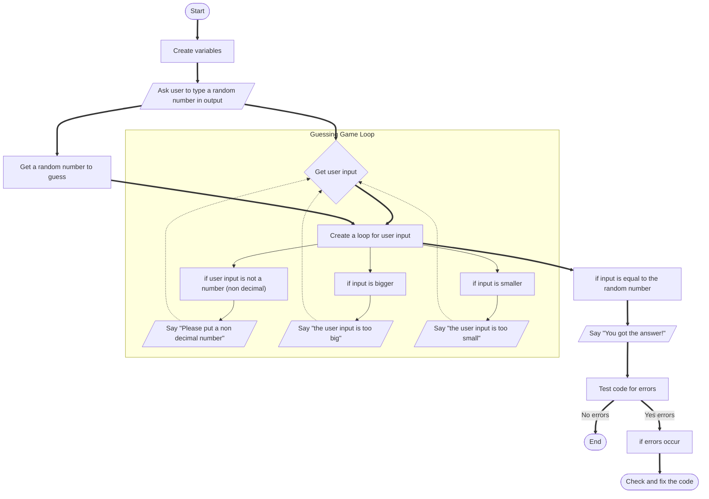

# Guessing.md

#Steps of the process

1. First, create variables to be used in the game, one to create a random number to be guessed and the other to get the users input
2. Make sure the user knows what to do by telling them in the output
3. Second, once the user inserts an input, create a loop that will continue until the user guesses correctly
4. The loop should include <,>,=, and !=. If the users input is not = to the random number that was generated the loop should restart after the user inputs a new number
5. Third, if the user inputs the wrong number, the program must tell the user in the output that the number was either too small, too big, or not a non decimal number
6. Fourth, if the program has any errors, check where they may be located and fix them
7. Finally, if the program runs without errors and works correctly, the program is finished

